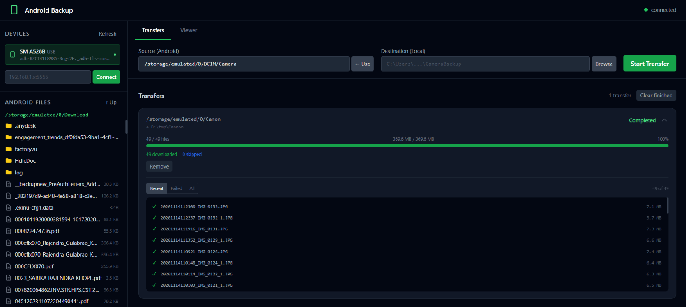

# Android Backup

Copy photos and files from your Android device to your PC via a web interface — with folder browsing, pause/resume transfers, file management, and Wi-Fi ADB support.



---

## Prerequisites

### 1. Go (1.21 or later)

Download and install from [go.dev/dl](https://go.dev/dl). Verify with:

```powershell
go version
```

### 2. ADB (Android Debug Bridge)

Download **Android SDK Platform Tools** from [developer.android.com/tools/releases/platform-tools](https://developer.android.com/tools/releases/platform-tools), extract the ZIP, and add the folder to your `PATH`.

Verify with:

```powershell
adb version
```

### 3. Enable USB Debugging on your Android device

1. Go to **Settings → About phone**
2. Tap **Build number** 7 times until you see *"You are now a developer!"*
3. Go to **Settings → System → Developer options**
4. Enable **USB Debugging**

---

## Build

```powershell
cd d:\projects\Software\AndroidBackup

# Download dependencies
go mod tidy

# Build the binary
go build -o androidbackup.exe .
```

---

## Run

```powershell
.\androidbackup.exe
```

Open your browser at **[http://localhost:8765](http://localhost:8765)**

To use a different port:

```powershell
$env:PORT = "9000"; .\androidbackup.exe
```

### Log levels

By default the app logs at **INFO** level (startup, requests, transfer lifecycle). Set to `debug` to see per-file ADB operations, or `warn`/`error` for quiet operation.

```powershell
# via environment variable
$env:LOG_LEVEL = "debug"; .\androidbackup.exe

# via command-line flag
.\androidbackup.exe --log-level=debug
```

| Level   | What you see |
|---------|--------------|
| `debug` | Every ADB browse/pull call, file skips, dir scans |
| `info`  | HTTP requests, transfer lifecycle, WiFi connect (default) |
| `warn`  | Failed files, failed connections |
| `error` | Server errors, scan failures |

Set `NO_COLOR=1` to disable colored output (e.g. when piping to a file).

---

## Connect your Android device

### Option A — USB

1. Connect the device with a USB cable.
2. When prompted on the phone, tap **Allow USB debugging**.
3. Verify the device is detected:

```powershell
adb devices
```

Expected output:

```
List of devices attached
RZXXXXXXXXX     device
```

### Option B — Wi-Fi

1. First connect via USB and run:

```powershell
adb tcpip 5555
```

2. Find your phone's IP address under **Settings → About phone → Status → IP address**.
3. Disconnect the USB cable.
4. In the web UI, enter the IP in the **Connect** field (e.g. `192.168.1.42`) and click **Connect**.

---

## Usage

| Step | Action |
|---|---|
| 1 | Open [http://localhost:8765](http://localhost:8765) |
| 2 | Your connected devices appear in the left panel — click one to select it |
| 3 | Browse the Android filesystem and navigate to the folder you want |
| 4 | Click **← Use** to fill in the source path, or type it manually |
| 5 | Click **Browse** next to the destination field to pick a local folder |
| 6 | Click **Start Transfer** |
| 7 | Monitor progress in the transfer queue — pause, resume, or cancel at any time |

### Resume an interrupted transfer

If a transfer stops (app closed, cable unplugged, etc.), reopen the app and click **Resume** on the paused transfer. Files already downloaded at their full size are skipped automatically.

### File management on device

Hover over any file or folder in the Android browser to reveal **rename** and **delete** buttons.

---

## Transfer state

Transfer progress is saved to:

```
%TEMP%\androidbackup_state.json
```

This file is read on startup, so transfers survive app restarts and can always be resumed.

---

## API reference

The server exposes a REST API if you want to automate or script operations.

| Method | Path | Description |
|---|---|---|
| `GET` | `/api/devices` | List connected ADB devices |
| `POST` | `/api/devices/connect` | Connect a Wi-Fi device `{"address":"192.168.1.x"}` |
| `POST` | `/api/devices/disconnect` | Disconnect a Wi-Fi device |
| `GET` | `/api/android/browse?serial=&path=` | List files/folders on device |
| `POST` | `/api/android/delete` | Delete a file or folder on device |
| `POST` | `/api/android/rename` | Rename or move a file on device |
| `GET` | `/api/local/browse?path=` | Browse local filesystem |
| `POST` | `/api/transfers` | Start a new transfer |
| `GET` | `/api/transfers` | List all transfers |
| `GET` | `/api/transfers/:id` | Get a specific transfer |
| `POST` | `/api/transfers/:id/pause` | Pause a running transfer |
| `POST` | `/api/transfers/:id/resume` | Resume a paused or failed transfer |
| `POST` | `/api/transfers/:id/cancel` | Cancel a transfer |
| `WS` | `/ws` | WebSocket stream for real-time progress events |

---

## Shell script (legacy)

The original Bash script is still available as `backup.sh`. See [README-sh.md](README-sh.md) for usage instructions.
